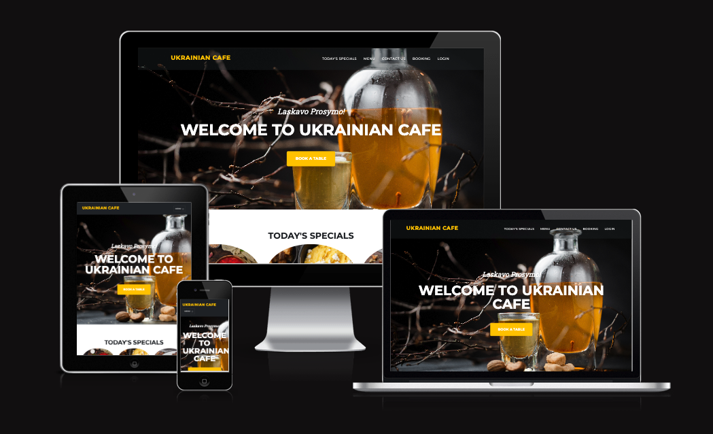
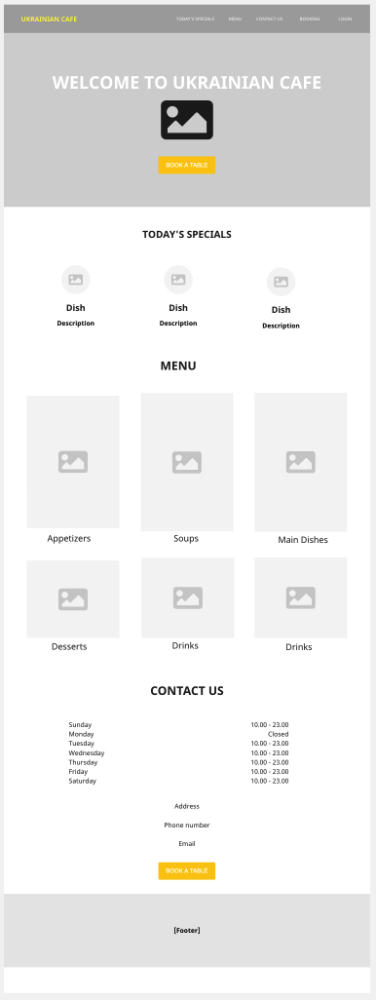
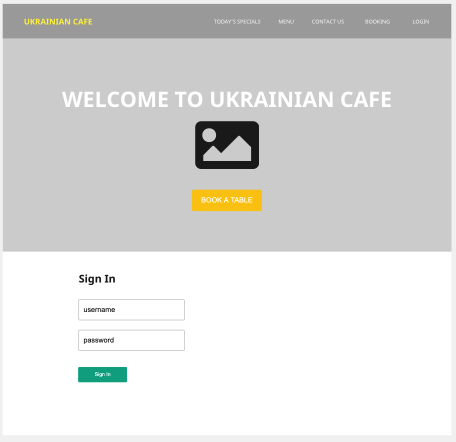
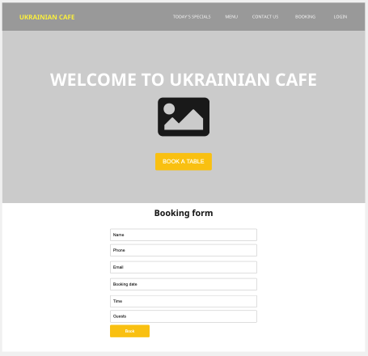
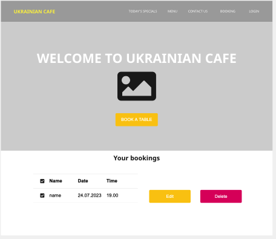

# Ukrainian Cafe

[View the live project here.](https://ukrainian-cafe-f4f96fd63fc0.herokuapp.com/)

The Ukrainian Cafe website is made for a cafe. This website shows today's specials, menu, contact information, and opening hours. Potential customers can register and book a table online using a form on the "Booking" page of the website. Registered users can view, edit and delete their bookings. Site user administrators have access to all bookings and all create, edit and delete functionalities. Administrators are also able to update today's specials list by adding new items, updating or deleting existing ones.

The website is designed to be responsible on a range of devices.




## Table of contents
 1. [ UX ](#ux)
 2. [Agile Development](#agile)
 3. [ Features ](#features)  
 4. [ Future Features ](#future)  
 5. [ Technology used ](#tech) 
 6. [ Testing ](#testing)  
 7. [ Bugs ](#bugs)  
 8. [ Deployment](#deployment)
 9. [ Credits](#credits)
 10. [ Content](#content)  
 11. [ Acknowledgements](#acknowledgements)

## User Experience (UX)
<a name="ux"></a>

#### Database Schema

##### Booking Model

| id | Field |
|--|--|
| user | FK |
| first_name | CharField |
| last_name | CharField |
| phone | CharField |
| email | EmailField |
| booking_date | DateField |
| time | CharField |
| guests | IntegerField |

---

##### Today's Specials Model

| id | Model |
|--|--|
| title | CharField |
| slug | SlugField |
| description | TextField |
| image | CloudinaryField |
| today | CharField |

### User Experience Design (UXD)

#### Overview
Ukrainian Cafe is a website for a fictional cafe. The main goal of the website is to allow users to book a table online, to see menu and today's specials, also to get contact information and opening hours.

#### Design
When I came up with the idea to create a website for a ukrainian cafe, I decided to make a simple intuitive landing page. I wanted to make it look modern, so I used modern ukrainian food photos. The colors are warm, buttons and logo are yellow to give a feeling of coziness.

#### Site User
- Someone who is originally ukrainian wants to visit a place with ukrainian food.
- Someone looking for a new experience, wanting to try new dishes.
- Someone who prefers to make online booking rather than making a phone call.

#### Goals for the website
- To allow customers to get acquainted with the menu.
- To allow customers to see relevant information on today's specials.
- To allow customers to make online bookings, to view, update, and delete them if necessary.
- To allow cafe administrators to view all bookings, update and delete them if necessary.
- To allow cafe administrators to update today's specials list.

### Wireframes
index.html



login.html



add_booking.html



view_booking.html



## Agile Development

### Agile Overview
<a name="agile"></a>

This project was started in a GitHub Projects Page to plan, track and manage the tasks to implement User Stories. The goal was to set out my expected workload, list the epics and then break them down into user stories or bite sized tasks to work towards and ultimately finish the site in good time.

To see Kanban please click [here](https://github.com/users/konstanciaa/projects/3).

At the initial stage of the project I decided on ten core requirements the app should have and five others which are good to have but not important.

Using these requirements I added user stories, acceptance criteria and the tasks to track development process.

Once I completed a task I would check the box. When all of the tasks were completed and acceptance criteria were met, I would move the user story from **In Progress** to **Done**.

### User Stories

#### Completed User Stories

Click on a user story to see the details.

1. [USER STORY: Deploy a project](https://github.com/konstanciaa/ukrainian-cafe/issues/1)
2. [USER STORY: Admin panel](https://github.com/konstanciaa/ukrainian-cafe/issues/2)
3. [USER STORY: Create menu](https://github.com/konstanciaa/ukrainian-cafe/issues/5)
4. [USER STORY: User registration and login](https://github.com/konstanciaa/ukrainian-cafe/issues/6)
5. [USER STORY: Booking a table](https://github.com/konstanciaa/ukrainian-cafe/issues/7)
6. [USER STORY: Edit booking](https://github.com/konstanciaa/ukrainian-cafe/issues/8)
7. [USER STORY: Cancel booking](https://github.com/konstanciaa/ukrainian-cafe/issues/9)
8. [USER STORY: Check bookings](https://github.com/konstanciaa/ukrainian-cafe/issues/10)
9. [USER STORY: Update today's specials](https://github.com/konstanciaa/ukrainian-cafe/issues/14)
10. [USER STORY: Edit or delete today's specials](https://github.com/konstanciaa/ukrainian-cafe/issues/15)

#### Future features user stories

1. [USER STORY: Create menu items](https://github.com/konstanciaa/ukrainian-cafe/issues/3)
2. [USER STORY: Update or delete menu items](https://github.com/konstanciaa/ukrainian-cafe/issues/4)
3. [USER STORY: Order meals](https://github.com/konstanciaa/ukrainian-cafe/issues/11)
4. [USER STORY: Photos of each dish](https://github.com/konstanciaa/ukrainian-cafe/issues/12)
5. [USER STORY: Confirm booking](https://github.com/konstanciaa/ukrainian-cafe/issues/13)

---

## Features
<a name="features"></a>

#### User based Features Implemented

- **Users can** register on a website
- **Users can** log into their account
- **Users can** log out of their account
- **Users can** book a table through the booking form **(Create)**
- **Users can** view their bookings **(Read)**
- **Users can** edit their bookings **(Update)**
- **Users can** delete their bookings **(Delete)**

#### User Restrictions
- **Users cannot** access the booking form until they sign up or login
- **Users cannot** see other users bookings

#### Business owner based Features implemented

- **Business owner can** make bookings through the booking form **(Create)**
- **Business owner can** view all bookings **(Read)**
- **Business owner can** edit all bookings **(Update)**
- **Business ownern can** delete all bookings **(Delete)**
- **Business owner can** add new items to Today's Specials using the form **(Create)**
- **Business owner can** view the list of all Today's Specials items **(Read)**
- **Business owner can** update any item from Today's Specials list **(Update)**
- **Business ownern can** delete Today's Specials items **(Delete)**

### Website Features

#### Today's Specials
- The home page displays 

#### Booking system


## Future features
<a name="future"></a>

## Technology used
<a name="tech"></a>

- **HTML**
- **CSS**
- **Python**
- **JavaScript** used for timeout function for messages and popup items in menu.
- **Django** was used to set up the structure, functionalities, data model and database of the website.
- **Font Awesome** was used for social network links in footer
- **Bootstrap5** was used to assist with the responsiveness and styling of the website.
- **Jinja Templating with Django** used to render logic within html documents and make the website more dynamic.
- **GitHub** is used to store the projects code after being pushed from Git.
- **Heroku** used to host and deploy this project.
- **ElephantSQL** was used as the database for this project during development and in production.
- **Cloudinary** was used to host images.
- **Git** was used for version control by utilizing the Gitpod terminal to commit to Git and Push to GitHub.
- **Miro** was used to create wireframes.


## Testing

## Deployment

#### Heroku 
1. The project was created in Github first and then transferred to the Gitpod development environment by the use of the green Gitpod button.

2. In the Gitpod environment a skeleton django project was created (project, app and relating files).

To deploy the project through Heroku I followed these steps:

- Sign up / Log in to [Heroku](https://www.heroku.com/)
- From the main Heroku Dashboard page select 'New' and then 'Create New App'.
- Give a name to the new project. The name must be unique.
- Create a database. Log in to [ElephantSQL](https://www.elephantsql.com/).
- Click "Create New Instance"
- Set up your plan. Give it a name (it can be the name of hte project)
- Select Region. Select a data center near you.
- Click "Review". Click "Create instance"
- Return to the ElephantSQL dashboard and click on the database instance name for this project.
- In the URL section, click the copy icon to copy the database URL.
- In your project workspace, create a file called env.py.
- Check if env.py file is included in the .gitignore file too.
- Within this file import the os library and set the environment variable for the DATABASE_URL pasting in the address copied from ElephantSQL.
- The line should appear as os.environ["DATABASE_URL"]= "Paste the link in here".
- Generate a secret key on the [Django Secret Key Generator](https://djecrety.ir/).
- Add a secret key to the app using os.environ["SECRET_KEY"] = "your secret key goes here".
- Add the secret key just created to the Heroku Config Vars as SECRET_KEY for the KEY value and the secret key value you created as the VALUE.
- In the settings.py file within the django app, import Path from pathlib, import os and import dj_database_url.
- Insert the line if os.path.isfile("env.py"): import env.
- Remove the insecure secret key that django has in the settings file by default and replace it with SECRET_KEY = os.environ.get('SECRET_KEY').
-  In the settings.py file, comment out the present code for databases and add code to use the currently set up django database URL as set in the env.py file and also in the Heroku config vars. 
- The code should appear as: DATABASES = { 'default': dj_database_url.parse(os.environ.get("DATABASE_URL"))} ensure the correct indentation for python is used.
- In the terminal migrate the models over to the new database connection.
- Navigate in a browser to [Cloudinary](http://cloudinary.com), log in, or create an account and log in.
- From the dashboard - copy the CLOUDINARY_URL to the clipboard.
- In the env.py file - add os.environ["CLOUDINARY_URL"] = "paste in the Url copied to the clipboard here".
- In Heroku, add the CLOUDINARY_URL and value copied to the clipboard to the config vars.
- Also add the KEY - DISABLE_COLLECTSTATIC with the Value - 1 to the config vars. This key value pair must be removed prior to final deployment.
- Add the cloudinary libraries to the list of installed apps, the order they are inserted is important, 'cloudinary_storage' goes above 'django.contrib.staitcfiles' and 'cloudinary' goes below it.
- In the Settings.py file - add the STATIC files settings - the url, storage path, directory path, root path, media url and default file storage path.
- Link the file to the templates directory in Heroku TEMPLATES_DIR = os.path.join(BASE_DIR, 'templates').
- Change the templates directory to TEMPLATES_DIR - 'DIRS': [TEMPLATES_DIR].
- Add Heroku to the ALLOWED_HOSTS list the format will be the app name given in Heroku when creating the app followed by .herokuapp.com.
- In your code editor, create three new top level folders, media, static, templates.
- Create a new file on the top level directory - Procfile.
- Within the Procfile add the code - web: guincorn PROJECT_NAME.wsgi.
- In the terminal, add the changed files, commit and push to GitHub.
- In Heroku, navigate to the deployment tab and deploy the branch manually - watch the build logs for any errors.
- Heroku will now build the app for you. Once it has completed the build process you will see a 'Your App Was Successfully Deployed' message and a link to the app to visit the live site.

#### Forking the repository

By forking the GitHub Repository you can make a copy of the original repository to view or change without it effecting the original repository. You can do this by:

- Sign up / Log in to GitHub.
- Locate


---

Happy coding!

**Media**
Photo: [name of the photographer], [name of the organization/company that donated the image or the photo] / ukraine.ua/imagebank
Traditional Ukrainian borscht - photo: Yevhen Kudriavtsev

Fried dumplings with onion and bacon top view - photo: nioloxs - Depositphotos (три вареника)

Spotykach. Liqueur made of berries or fruits - photo:  - klopotenko.com (ликер на темном фоне)

Borscht with prunes and porcini mushrooms - photo:  - klopotenko.com (борщ в правом углу на сером фоне)

Ukrainian varenyky with potatoes and onion - photo: Yevhen Kudriavtsev (варениеи картошкойб цибулей и салом)

Lard with spices and herbs on a old wooden table - photo: igorr1 - Depositphotos (salo vertical)

Borscht is a beetroot soup that has over 70 recipes. Usually served with garlic fritters called pampushky. It is included on the list of the Ukrainian intangible heritage - photo: Oksana Sybydlo Food Photographer / їzhakultura - Ukrainian Institute (борщ в треугольной тарелке)

Delicious Chicken Kyiv and mashed potato served on plate on wooden table - photo: AntonMatyukha - Depositphotos (chicken Kyiv)

Spotykach. Liqueur made of berries or fruits - photo:  - klopotenko.com

Traditional kvass beer mug with rye bread on wooden table - photo: etorres69 - Depositphotos

Field of the green wheat near Kitsman, Chernivtsi region - photo: Max Kozmenko


**Bugs**
1. When I upload an image in "Add Specials" form, the image won't show up. 

Solution: I had to retrieve request.FILES in the view:
```
form = SpecialsForm(request.POST, request.FILES)
```
and add the following enctype to the form in html file:
```
<form method="POST" name="form" enctype="multipart/form-data"></form>
```


2. Booking form not rendering in html. 

I found solution on [stackoverflow.com](https://stackoverflow.com/questions/75495403/django-returns-templatedoesnotexist-when-using-crispy-forms) 

It says: "inside settings.py in the main app add INSTALLED_APPS = [ ... 'crispy_forms', 'crispy_bootstrap4', ... ] and CRISPY_TEMPLATE_PACK = 'bootstrap4'." 

I applied that tip. The booking form is now displayed on add_booking.html.
