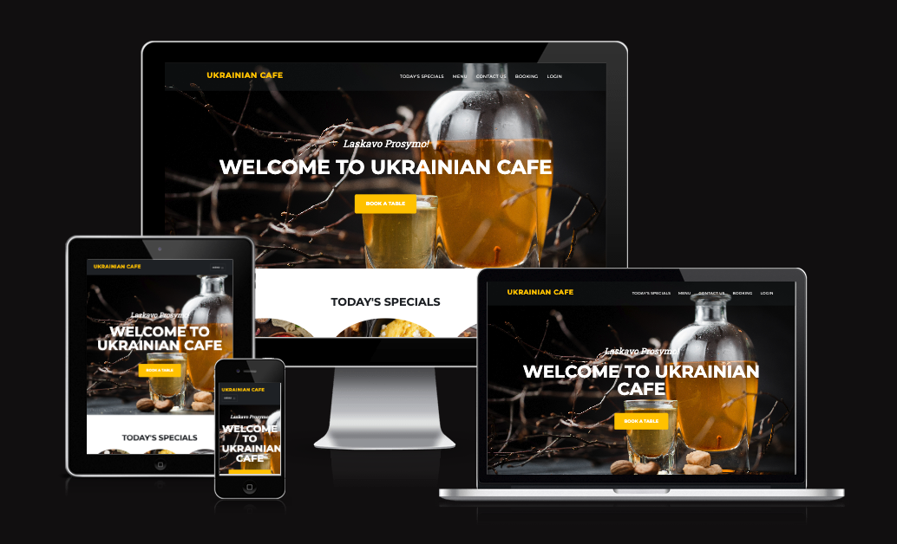

# Ukrainian Cafe

[View the live project here.](https://ukrainian-cafe-f4f96fd63fc0.herokuapp.com/)

The Ukrainian Cafe website is made for a cafe. This website shows today's specials, menu, contact information, and opening hours. Potential customers can register and book a table online using a form on the "Booking" page of the website. Registered users can view, edit and delete their bookings. Site user administrators have access to all bookings and all create, edit and delete functionalities. Administrators are also able to update today's specials list by adding new items, updating or deleting existing ones.

The website is designed to be responsible on a range of devices.




## Table of contents
 1. [ UX ](#ux)
 2. [Agile Development](#agile)
 3. [ Features ](#features)  
 4. [ Future Features ](#future)  
 5. [ Technology used ](#tech) 
 6. [ Testing ](#testing)  
 7. [ Bugs ](#bugs)  
 8. [ Deployment](#deployment)
 9. [ Credits](#credits)
 10. [ Content](#content)  
 11. [ Acknowledgements](#acknowledgements)

## User Experience (UX)
<a name="ux"></a>

#### Database Schema

##### Booking Model

| id | Field |
|--|--|
| user | FK |
| first_name | CharField |
| last_name | CharField |
| phone | CharField |
| email | EmailField |
| booking_date | DateField |
| time | CharField |
| guests | IntegerField |

---

##### Today's Specials Model

| id | Model |
|--|--|
| title | CharField |
| slug | SlugField |
| description | TextField |
| image | CloudinaryField |
| today | CharField |

### User Experience Design (UXD)

#### Overview
Ukrainian Cafe is a website for a fictional cafe. The main goal of the website is to allow users to book a table online, to see menu and today's specials, also to get contact information and opening hours.

#### Design
When I came up with the idea to create a website for a ukrainian cafe, I decided to make a simple intuitive landing page. I wanted to make it look modern, so I used modern ukrainian food photos. The colors are warm, buttons and logo are yellow to give a feeling of coziness.

#### Site User
- Someone who is originally ukrainian wants to visit a place with ukrainian food.
- Someone looking for a new experience, wanting to try new dishes.
- Someone who prefers to make online booking rather than making a phone call.

#### Goals for the website
- To allow customers to get acquainted with the menu.
- To allow customers to see relevant information on today's specials.
- To allow customers to make online bookings, to view, update, and delete them if necessary.
- To allow cafe administrators to view all bookings, update and delete them if necessary.
- To allow cafe administrators to update today's specials list.

### Wireframes
index.html


login.html


add_booking.html


view_booking.html


## Agile Development

## Features

## Future features

## Technology used
Miro - Wireframes

## Testing

## Deployment


---

Happy coding!

**Media**
Photo: [name of the photographer], [name of the organization/company that donated the image or the photo] / ukraine.ua/imagebank
Traditional Ukrainian borscht - photo: Yevhen Kudriavtsev

Fried dumplings with onion and bacon top view - photo: nioloxs - Depositphotos (три вареника)

Spotykach. Liqueur made of berries or fruits - photo:  - klopotenko.com (ликер на темном фоне)

Borscht with prunes and porcini mushrooms - photo:  - klopotenko.com (борщ в правом углу на сером фоне)

Ukrainian varenyky with potatoes and onion - photo: Yevhen Kudriavtsev (варениеи картошкойб цибулей и салом)

Lard with spices and herbs on a old wooden table - photo: igorr1 - Depositphotos (salo vertical)

Borscht is a beetroot soup that has over 70 recipes. Usually served with garlic fritters called pampushky. It is included on the list of the Ukrainian intangible heritage - photo: Oksana Sybydlo Food Photographer / їzhakultura - Ukrainian Institute (борщ в треугольной тарелке)

Delicious Chicken Kyiv and mashed potato served on plate on wooden table - photo: AntonMatyukha - Depositphotos (chicken Kyiv)

Spotykach. Liqueur made of berries or fruits - photo:  - klopotenko.com

Traditional kvass beer mug with rye bread on wooden table - photo: etorres69 - Depositphotos

Field of the green wheat near Kitsman, Chernivtsi region - photo: Max Kozmenko


**Bugs**
1. When upload image in form "Add Specials", image won't show up. 

Solution: I had to retrieve request.FILES in the view:
```
form = SpecialsForm(request.POST, request.FILES)
```
and add the following enctype to the form in html file:
```
<form method="POST" name="form" enctype="multipart/form-data"></form>
```
2. Menu links don't work on the Booking page.

3. Booking form not rendering in html. I found solution on [stackoverflow.com](https://stackoverflow.com/questions/75495403/django-returns-templatedoesnotexist-when-using-crispy-forms) It says: "inside settings.py in the main app add INSTALLED_APPS = [ ... 'crispy_forms', 'crispy_bootstrap4', ... ] and CRISPY_TEMPLATE_PACK = 'bootstrap4'." It helped me to solve the problem. The booking is now displayed on add_booking.html.
